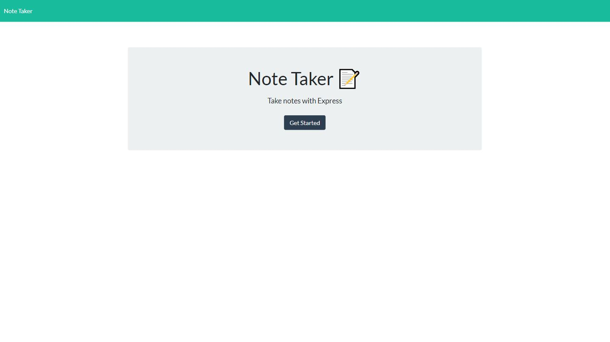
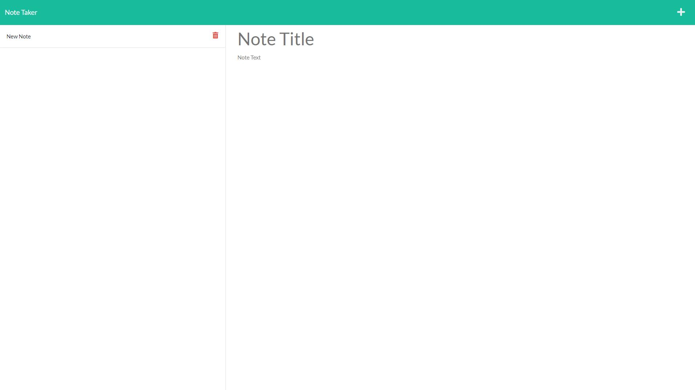
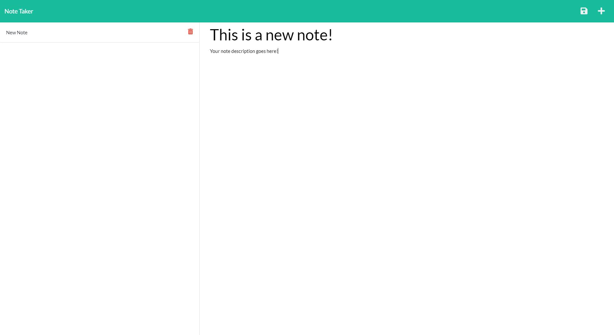
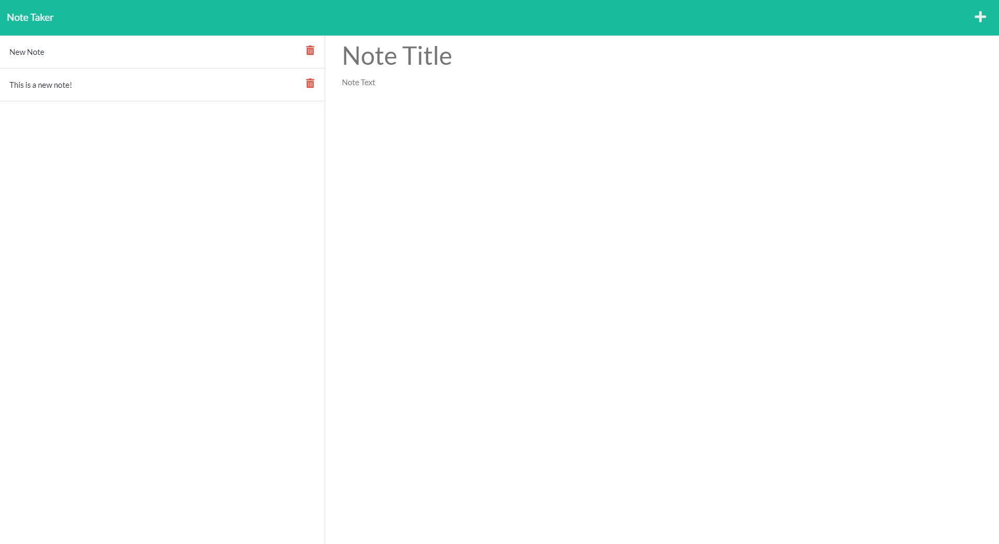

# Note-Taker

## Description
This is an app that is used to take and save notes. The user has the ability to enter in a note title and some note text. The user can than save this note and it will appear on the left hand side of the screen for later viewing.

 

## Installation and Operation
To run the app locally, the user should locally clone the repo and navigate to the repo in the command line. Once in the repo, run `npm install` to install all of the required dependencies. From there run `node server.js` to start the server. From there you should connect to localhost:3000 in your browser of choice, and the app should be up and running.

 

## Images

**Above is an image of the webpage upon launching it**

 

**Above is an image of the notes section of the webpage upon clicking Get Started on the initial webpage**

 

**Above is an image of a new note that can be saved by clicking the floopy disk icon that appears in the top right**

 

**Above is an image showing that the saved notes appear on the left hand save and can be deleted or reloaded for later viewing**

 

Link to deployed app: https://piscine-fromage-85822.herokuapp.com/